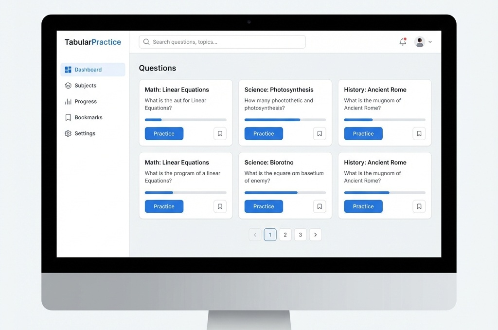

# TabularPractice - 刷题看板


TabularPractice 是一个基于 Next.js 构建的现代化刷题进度管理与复习系统。它专为各类考试复习设计，帮助你可视化地追踪每一道真题的掌握情况，拒绝无效刷题。



## 🌐 在线演示

👉 **立即体验**：[https://tabularpractice.vercel.app/](https://tabularpractice.vercel.app/)

> 💡 **提示**：本站支持 **PWA (Progressive Web App)** 技术。
> - **桌面端**：点击浏览器地址栏右侧的“安装”图标，即可作为独立应用运行，支持离线访问。
> - **移动端**：使用 Safari 或 Chrome 的“添加到主屏幕”功能，获得类原生 App 的全屏体验。
>
> ⚠️ **数据源说明**：
> 本演示站点托管于 Vercel 免费套餐，默认内置了 **2009-2025 考研数学一** 真题源（存储于 GitHub）。
> 如果您所在的网络环境访问 GitHub 存在困难（导致题目加载失败），可以在设置中**自行添加其他可访问的题目源**。

## ✨ 主要特性

- **可视化仪表盘**：
  - 📊 **进度追踪**：通过图表直观展示“已斩”（掌握）、“懵圈”（模糊）、“崩盘”（错误）的题目分布。
  - 🔥 **活跃热力图**：像 GitHub 贡献图一样记录你每天的奋斗足迹。
  - 📅 **多维度分析**：支持按学科（如数学一、专业课）对比复习进度。

- **沉浸式刷题体验**：
  - 🏷️ **状态管理**：一键标记题目状态，自动归入错题本或复习队列。
  - 📝 **Markdown & LaTeX 支持**：完美渲染数学公式和复杂的题目解析（基于 KaTeX）。
  - 📱 **PWA 支持**：基于 Serwist 构建，支持安装到桌面或手机，离线也能查看部分内容。

- **灵活的数据结构**：
  - 支持 **试卷组 (PaperGroup)** -> **试卷 (Paper)** -> **题目 (Question)** 的层级结构。
  - 支持 **统考**与**自命题**科目的分类管理。

## 🛠️ 技术栈

本项目使用最新的前端技术栈构建：

- **框架**: [Next.js 16](https://nextjs.org/) (App Router)
- **UI 库**: [React 19](https://react.dev/), [Tailwind CSS v4](https://tailwindcss.com/), [Shadcn UI](https://ui.shadcn.com/)
- **图表**: [Recharts](https://recharts.org/)
- **状态管理**: [Zustand](https://github.com/pmndrs/zustand)
- **数学公式**: KaTeX, Rehype-Katex, Remark-Math
- **PWA**: @serwist/next

## 🚀 快速开始

### 1. 克隆项目

```bash
git clone [https://github.com/tinnci/tabularpractice.git](https://github.com/tinnci/tabularpractice.git)
cd tabularpractice